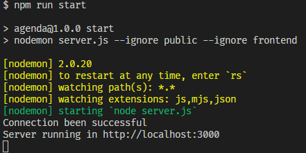
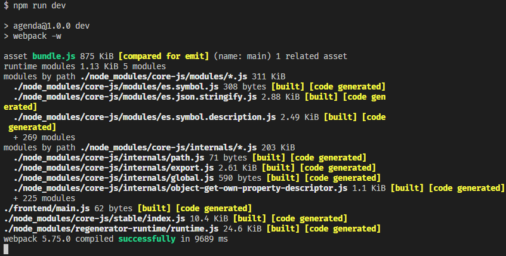
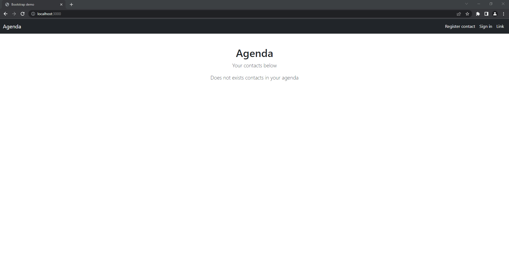
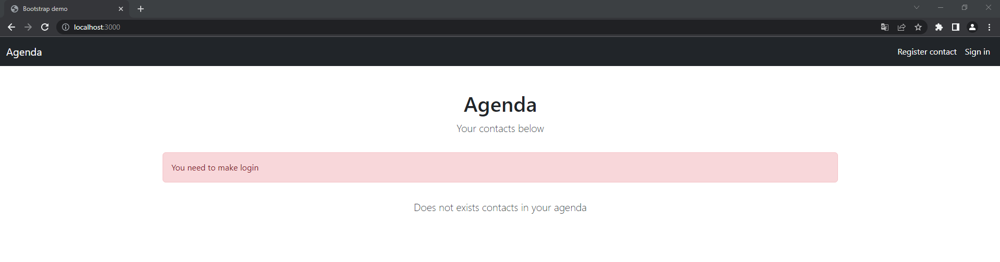
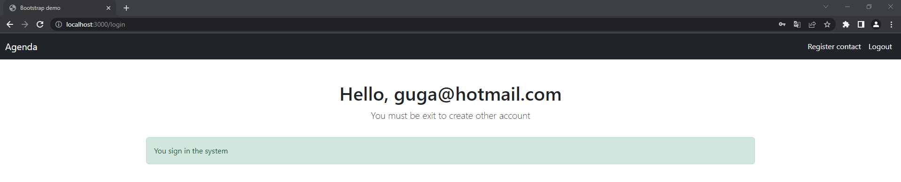
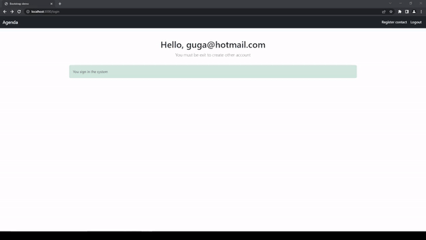
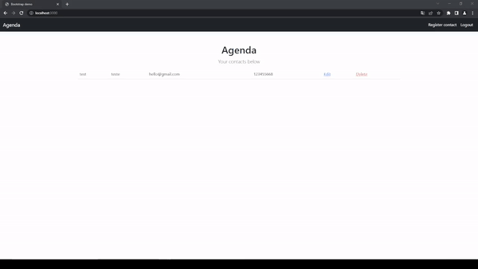
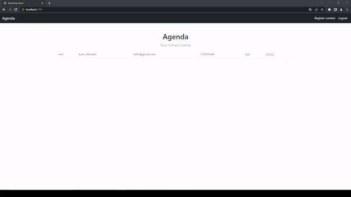
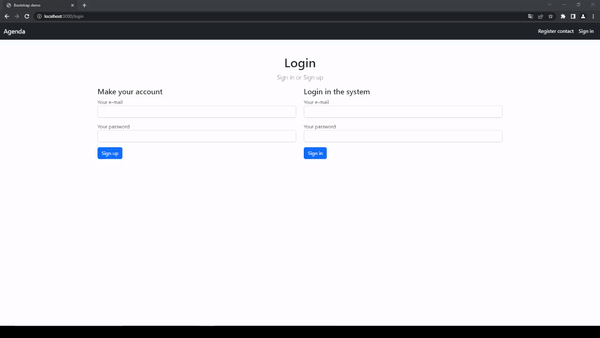
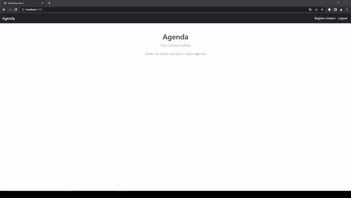

# &#x1F4D2; Projeto Agenda

Projeto feito em **Node** em conjunto com o **Express** para a criação de uma agenda de contatos que podem ser adicionados, excluidos, listados e editados.


***

## &#x1F9F0; Ferramentas Necessárias
* [Visual Studio Code](https://code.visualstudio.com/) - Editor de código **recomendado** para rodar a aplicação.
* [NodeJS](https://nodejs.org/en/) - Framework JavaScript **necessário** para rodar os comandos de execução do programa.

***

## &#x2699; Configurações Iniciais

> IMPORTANTE! O projeto funciona na versão v16.20.0 (LTS) do Node, pode ser que em uma versão diferente o projeto não funcione como esperado, neste caso use o [NVM](https://github.com/coreybutler/nvm-windows) para gerenciar as versões do Node no seu computador

1. Depois de clonado este repositório, abra um terminal na pasta raiz do projeto e digite o comando:

```
npm install
```

Após instalada as bibliotecas necessárias, execute os comandos:

> Observação: Os comandos devem ser executados em terminais diferentes na pasta raiz do projeto

```
npm run start
```

```
npm run dev
```

A sua saída deve ser algo parecido com isso:





2. Abra algum navegador de sua preferência, (recomendado usar o Chrome), e navegue para a seguinte *URL* *`http://localhost:3000`*.

A seguinte página será exibida:



***

## &#x1F525; Como Executar

Ao clicar no link de "Register contact" no canto superior direito, um aviso será exibido pedindo para fazer login:



Para isso, clique no link de "Sign in" para realizar ou a criação de uma conta, ou o login de uma conta já existente.

Depois de logado, um aviso vai aparecer na página dizendo que o login foi efetuado com sucesso:



Depois, basta registrar os contatos e ir navegando pelo projeto usando as funcionalidades (gifs abaixo):

### Criando um Contato



### Editando um Contato



### Deletando um Contato



### Criando uma Conta no Sistema



### Logout do Sistema


